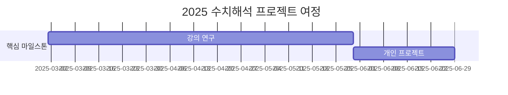

# 10th-template

<h1 align="center"> 10th Template </h1>

<div align="center">
<a href="https://pseudo-lab.com"></a>
<a href="https://discord.gg/EPurkHVtp2"></a>
<a href="https://github.com/Pseudo-Lab/10th-template/stargazers"></a>
<a href="https://github.com/Pseudo-Lab/10th-template/network/members"></a>
<a href="https://github.com/Pseudo-Lab/10th-template/pulls"></a>
<a href="https://github.com/Pseudo-Lab/10th-template/issues"></a>
<a href="https://github.com/Pseudo-Lab/10th-template/graphs/contributors"></a>
<a href="https://hits.seeyoufarm.com"></a>
</div>
<br>

<!-- sheilds: https://shields.io/ -->
<!-- hits badge: https://hits.seeyoufarm.com/ -->

> Welcome to the Numerical Convex Repository! We aim to explore convex optimization by studying Professor Stephen Boyd’s lectures, utilizing CVXPY, and solving various convex problems. Our goal is to become familiar with optimization techniques, offering tools and frameworks for practical implementation, algorithm development, and theoretical insights. Join us in advancing the field of convex optimization through open collaboration and innovation!

## 🌟 프로젝트 목표 (Project Vision)
_"수치해석 프로젝트 컨벡스 최적화편"_  
- Convex optimization 스터디 및 프로젝트
- 개인 성장과 집단 지혜의 시너지 창출
- 공학적인 문제를 최적화 문제로 바꾸는 능력
- 머신러닝에 필수적인 최적화 기법 학습


## 🧑 역동적인 팀 소개 (Dynamic Team)

| 역할          | 이름 |  기술 스택 배지                                                                 | 주요 관심 분야                          |
|---------------|------|-----------------------------------------------------------------------|----------------------------------------|
| **Project Manager** | 임진우 |   | 생성형 AI/추천 시스템 최적화             |
| **Member** | 레오나르도 다빈치 |   | 데이터 파이프라인 설계                  |


## 🚀 프로젝트 로드맵 (Project Roadmap)



## 🛠️ 우리의 개발 문화 (Our Development Culture)
**우리의 개발 문화**  
```python
class CollaborationFramework:
    def __init__(self):
        self.tools = {
            'communication': 'Discord',
            'version_control': 'GitHub Projects',
            'ci/cd': 'GitHub Actions',
            'docs': 'Github Wiki'
        }
    
    def workflow(self):
        return """주간 사이클:
        1️⃣ 월요일~목요일: 강의 듣기 (Notion 타임라인 공유)
        2️⃣ 금요일: 강의 리뷰 세션 (Live Share)
        3️⃣ 토요일~일요일: 강의 복습"""
```


## 💻 주차별 활동 (Activity History)

| 날짜 | 내용 | 발표자 | 
| -------- | -------- | ---- |
| 2025/02/ | OT       |      |
| 2025/02/ |  Part 1. | 미정 | 
| 2025/02/ |  Part 2. | 미정 | 
| 2025/02/ |  Part 3. | 미정 | 
| 2025/03/ |  Part 4. | 미정 | 
| 2025/03/ |  Part 5. | 미정 | 


## 💡 학습 자원 (Learning Resources)
**스터디 자료**  
- [인하대학교 김종한 교수님 홈페이지](https://jonghank.github.io/ase7030.html): 김종한 교수님의 컨벡스 최적화 강의자료
- [Stephen boyd 교수님 저서](https://stanford.edu/~boyd/cvxbook/): 컨벡스 최적화 본교재


## 🌱 참여 안내 (How to Engage)
**팀원으로 참여하시려면 러너 모집 기간에 신청해주세요.**  
- 링크 (준비중)

**누구나 청강을 통해 모임을 참여하실 수 있습니다.**  
1. 특별한 신청 없이 정기 모임 시간에 맞추어 디스코드 #Room-AN 채널로 입장
2. Pseudo Lab 행사에서 만나기

## Acknowledgement 🙏

Numerical Convex Project is developed as part of Pseudo-Lab's Open Research Initiative. Special thanks to our contributors and the open source community for their valuable insights and contributions.

## About Pseudo Lab 👋🏼</h2>

[Pseudo-Lab](https://pseudo-lab.com/) is a non-profit organization focused on advancing machine learning and AI technologies. Our core values of Sharing, Motivation, and Collaborative Joy drive us to create impactful open-source projects. With over 5k+ researchers, we are committed to advancing machine learning and AI technologies.

<h2>Contributors 😃</h2>
<a href="https://github.com/Pseudo-Lab/numerical_pr_2/contributors">
  
</a>
<br><br>

<h2>License 🗞</h2>

This project is licensed under the [MIT License](https://opensource.org/licenses/MIT).
